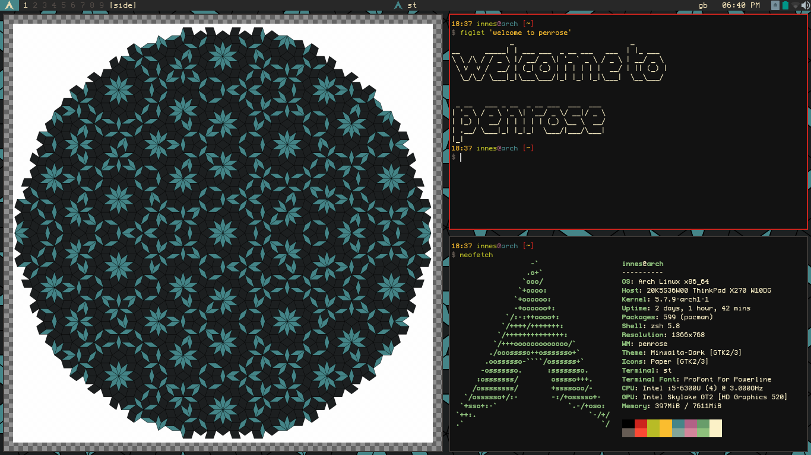

<image width="100px" src="icon.svg" align="left"></image>
penrose - a tiling window manager library
=========================================

 

`penrose` is a library for configuring your own X11 window manager in Rust. It
uses a workspace model (as opposed to tags) and is built on top of the XCB API.
The project is very much a work in progress as I try to set up my ideal, minimal
window manager for daily use. `penrose` is now feature complete enough and
stable enough to use as your primary Window Manager, so long as you don't mind a
few rough edges! I am aiming for the code to be well documented and easy to
extend. For now, this is my primary hobby project so updates are frequent: I try
to keep crates.io up to date but please check the git repo for latest changes.

### Current project status
While the project is still in its early stages, please expect there to be
multiple breaking changes as the public API stabilises. The example config file
will always be kept up to date so please refer to that for updating to newer
versions published to cargo.

I am currently using penrose as [my daily driver](https://github.com/sminez/my-penrose-config)
and actively working on the project: poking around in the guts of various
existing window managers, seeing what I like and what I want to incorporate.
Development may be a little sporadic depending on what my current work / home
commitments are but you can typically expect to see updates every few days
currently. I am trying to provide some demos and examples on
[youtube](https://www.youtube.com/channel/UC04N-5DxEWH4ioK0bvZmF_Q) as I go,
particularly when major new features are added.

If you don't mind a bare bones (_really_ bare bones) window manager then you can
take penrose for a spin using one of the set-ups in the `examples` directory.
You will need to update the keybindings to launch your preferred terminal
emulator and program launcher and may want to adjust the floating window classes
to handle some additional programs. The aim is to provide an Xmonad style
"extend with your own custom code" experience though obviously at present,
penrose has no where near the same number of out of the box libraries and
examples to work from so you will likely need to port over your favourite Xmonad
/ other WM features. If you are happy to do so, please raise a PR and I can
incorporate your favourite feature into some sort of `contrib` directory so that
others can use it as well.

#### Current functionality
As a non-exhaustive high-level summary, penrose currently supports the following
features:
- multi-monitor support
- dynamic layouts
- user defined hooks
- partial EWMH support (active window/desktop, number of desktops, desktop
  names, window manager name, desktop for client)
- user defined layout functions (`side_stack`, `bottom_stack` and `paper` implemented)
- configurable window borders for focused / unfocused
- configurable gaps
- configurable keybindings (internal methods and external programs)
- floating windows

Please see the documentation for available WindowManager methods.

### Project Non-goals
- A config file
  - Parsing a config file and dynamically switching behaviour on the contents
  adds a huge amount of complexity to the code. I'd much rather keep the code
  simple and well documented so that modifying it is easy and then just
  recompile.

- IPC / relying on external programs
  - I love acme from plan9 and how easy it is to drive it's state from external
  programs (check out my [acme-corp](https://github.com/sminez/acme-corp) tools
  to see what I mean) but that comes at the expense of the internal logic
  becoming _massively_ more complicated. As few moving parts as possible is
  ideal. So, things that are easy to acomplish using the XCB api (key bindings,
  simple rendering of a bar etc) are in, full on IPC via an exposed API is out.
